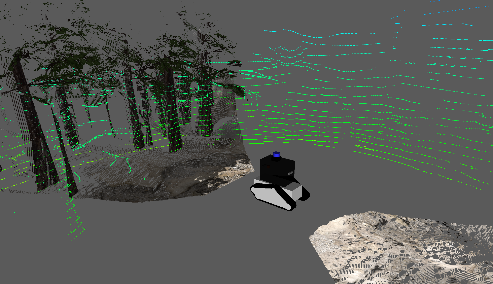

# Jo Description
[](https://docs.ros.org/)
[](https://gazebosim.org/)
[](https://www.docker.com/)
[](https://ubuntu.com/)
[](https://navigation.ros.org/)

A comprehensive ROS 2 robot description package for the Jo tracked robot platform, featuring complete robot modeling, simulation, and navigation capabilities using Gazebo (Harmonic) and ROS 2 Jazzy.

<div align="center">
  
</div>


## Key Features

- **Complete URDF/Xacro Model**
- **Gazebo Harmonic Simulation**
- **Sensor Suite**:
  - Velodyne LiDAR (3D point cloud)
  - Front and back depth cameras (RGB-D)
  - IMU sensor for orientation/acceleration
  - Track simulation
- **Navigation Ready**: Pre-configured Nav2 stack for autonomous (mapless) navigation 
- **Docker Support**: Full containerized environment with GPU acceleration
- **RViz Visualization**: Pre-configured visualization configs for display, simulation, and navigation


## Project Structure
```
jo_description/
├── launch/                 # ROS 2 launch files
├── urdf/                   # Robot URDF/Xacro models
├── config/                 # Configuration files (bridge, nav2 params)
├── rviz/                   # RViz visualization configs
├── worlds/                 # Gazebo simulation worlds
└── package.xml            # ROS 2 package manifest
```

# Quick Start

## Prerequisites
To correctly install the docker with GPU access, these steps need to be followed:
1. Install Docker Engine with their [guide](https://docs.docker.com/engine/install/ubuntu/)
2. Allow Docker usage as non-root user ([guide](https://docs.docker.com/engine/install/linux-postinstall/))
3. Correctly install [nVidia drivers](https://github.com/oddmario/NVIDIA-Ubuntu-Driver-Guide)
4. Install the [`nvidia-container-toolkit`](https://docs.nvidia.com/datacenter/cloud-native/container-toolkit/latest/install-guide.html)

## Building and Running

### 1. **Start and build the docker image**:
```bash
docker compose up --build
```

### 2. **Access the container**:
```bash
docker compose exec jo-sim bash
```

### Inside the Container

Once in the container, you can run various launch files:

### 1. View Robot Description (RViz only)
```bash
ros2 launch jo_description description.launch.py use_rviz:=true
```
This will launch the RViz configuration to see the URDF model of the robot.

### 2. Run Full Simulation with Gazebo
```bash
ros2 launch jo_description launch_sim.launch.py rviz:=true
```

This launches:
- Gazebo simulator with the robot in an office world
- Robot state publisher 
- ROS-Gazebo bridge for sensor/actuator communication
- RViz visualization

The simulation includes:
- Simulated tracks using Gazebo's TrackedVehicle and TrackController plugins
- Simulated IMU
- Simulated 3D GPU lidar using RGLGazeboPlugin
- Two simulated RGBD cameras
- Several premade worlds, most coming from [this repo](https://github.com/leonhartyao/gazebo_models_worlds_collection.git)

To control the robot you will need to open another terminal and run 
```bash
ros2 run teleop_twist_keyboard teleop_twist_keyboard --ros-args -p use_sim_time:=true
```
<div align="center">
  
  
</div>

### 3. Autonomous Navigation with Nav2
```bash
ros2 launch jo_description launch_sim.launch.py
# In another terminal:
ros2 launch jo_description navigation.launch.py rviz:=true use_sim_time:=true
```
Beside the simulation this will launch the navigation stack and RViz configured to see the perception stack, the local costmap as well as the planned path. To give the robot a desired waypoint you need to click on RViz 2D Goal Pose and select the desired point on the map.

**Note:** to correctly run the navigation stack, the odometry is expected on the topic ```/glim_ros/odometry_corrected```. This can be changed in ```nav2_params.yaml``` if you want to use another odometry source.
The intended way to run the odometry is by running [GLIM](https://github.com/koide3/glim.git) as implemented in [jo-zotac](https://github.com/mlisi1/jo-zotac.git).


<div align="center">
  
</div>

## ROS Topics

### Sensor Topics (Published by Gazebo)
```
/odom                           # TrackedVehicle Odometry (not working properly)
/imu/data                       # IMU data
/velodyne_points                # Lidar point cloud
/front_camera/image             # Front RGB camera image
/front_camera/camera_info       # Front camera intrinsics
/front_camera/points            # Front camera point cloud
/front_camera/depth             # Front depth image
/back_camera/image              # Back RGB camera image
/back_camera/camera_info        # Back camera intrinsics
/back_camera/points             # Back camera point cloud
/back_camera/depth              # Back depth image
```

### Control Topics (Subscribed)
```
/cmd_vel                        # Velocity command (geometry_msgs/Twist)
```


## Launch File Arguments

### description.launch.py
```bash
use_rviz:=true/false            # Enable RViz visualization (default: false)
use_sim_time:=true/false        # Use Gazebo simulation time (default: false)
```

### launch_sim.launch.py
```bash
rviz:=true/false                # Enable RViz visualization (default: false)
world:=<path_to_world>          # Gazebo world file
```

### navigation.launch.py
```bash
use_sim_time:=true              # Always true in simulation
```

## Configuration

### Gazebo Bridge Configuration
The `config/gz_bridge.yaml` file configures which ROS topics are bridged with Gazebo:
- Sensor data publishing (cameras, LiDAR, IMU)
- Velocity command subscription
- Image transport setup

### Navigation Parameters
`config/nav2_params.yaml` contains Nav2-specific parameters:
- Planner algorithms (NavFn, Theta*)
- Controller parameters (DWB, Regulated Pure Pursuit)
- Costmap configuration
- Behavior tree parameters

### RViz Configurations
Three pre-configured RViz layouts are provided:
- **display.rviz**: Shows robot model with TF frames
- **sim.rviz**: Simulation-focused with sensor visualizations
- **navigation.rviz**: Navigation-focused with costmaps and plans


### Custom Worlds
Place custom world files in `jo_description/worlds/external/worlds/`:
```bash
ros2 launch jo_description launch_sim.launch.py world:=/path/to/custom.world
```


## Additional Resources

- [ROS 2 Documentation](https://docs.ros.org/)
- [Gazebo Documentation](https://gazebosim.org/)
- [Navigation2 Documentation](https://navigation.ros.org/)
- [URDF Documentation](http://wiki.ros.org/urdf)
- [ROS 2 Control Documentation](https://control.ros.org/)

